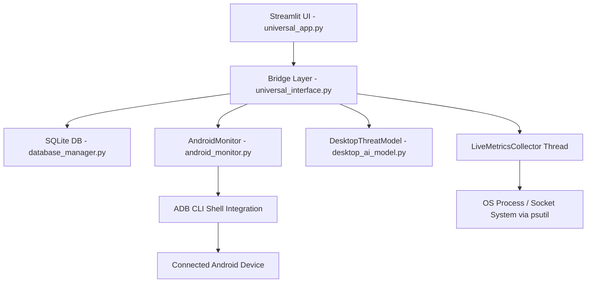

# SilentGuard AI 🛡️
## System Architecture, Functional Catalog, and UI/UX Design Blueprint

This document provides a highly detailed, comprehensive guide to the **SilentGuard AI** codebase. It outlines the core components, background services, data models, database structures, and every single frontend view in detail. Use this document as your primary developer reference and command center while **vibe coding** updates, refactoring components, or adding new features!

---

## Table of Contents
1. [System & Architectural Overview](#1-system--architectural-overview)
2. [Backend Architecture & Functions](#2-backend-architecture--functions)
    - [A. Local Heuristic Engine (`desktop_ai_model.py`)](#a-local-heuristic-engine-desktop_ai_modelpy)
    - [B. ADB Android Controller (`android_monitor.py`)](#b-adb-android-controller-android_monitorpy)
    - [C. Local SQLite Database (`database_manager.py`)](#c-local-sqlite-database-database_managerpy)
    - [D. Integration Bridging Layer (`universal_interface.py`)](#d-integration-bridging-layer-universal_interfacepy)
3. [UI/UX Design System & Custom CSS](#3-uiux-design-system--custom-css)
4. [Streamlit Views & Frontend Layouts](#4-streamlit-views--frontend-layouts)
    - [1. Sidebar Navigation & Control Panel](#1-sidebar-navigation--control-panel)
    - [2. Security Overview (Unified Monitor)](#2-security-overview-unified-monitor)
    - [3. AI Behavior Analysis (Behavioral Intelligence)](#3-ai-behavior-analysis-behavioral-intelligence)
    - [4. Observed Applications](#4-observed-applications)
    - [5. Manual Threat Scan](#5-manual-threat-scan)
    - [6. File Scan (📂 File Analysis)](#6-file-scan--file-analysis)
    - [7. Privacy Risk Center (Privacy & Data)](#7-privacy-risk-center-privacy--data)
5. [Vibe Coding Cheat-Sheet & Strategy](#5-vibe-coding-cheat-sheet--strategy)

---

## 1. System & Architectural Overview

SilentGuard AI operates on a **hybrid, localized, agentic security model** that targets cross-platform desktop operating systems (Windows, macOS, Linux) and connected Android mobile devices. 

Unlike traditional signature-based antiviruses, SilentGuard AI operates on a **zero-signature behavioral detection paradigm**:
* **Baseline Resource Monitoring**: Tracks real-time CPU, Memory, Disk, and Network telemetry to detect anomalies.
* **Local Heuristic Scanners**: Scans process signatures, active port binders, and suspicious command-line parameters in real time.
* **Deep Sensor Interrogation**: Communicates via ADB to parse background sensor states (Camera, Mic, Location) and isolate stalkerware/spyware behaviors.
* **SQLite Forensics**: Persists historical scans, threat parameters, and CPU metrics for chronological logs.



---

## 2. Backend Architecture & Functions

### A. Local Heuristic Engine (`desktop_ai_model.py`)
This module encapsulates the local signature-less process classification. It flags suspicious applications based on resource load, name masquerading, and process parameter anomalies.

* **Class**: `DesktopThreatModel`
* **Instance Variables**:
    * `self.suspicious_keywords`: List of key terms representing dangerous utilities (`keylog`, `rat`, `stealer`, `trojan`, `powershell -w hidden`, `nc -e`, `xmrig`, etc.).
    * `self.system_impersonators`: Standard Windows operating system process names (`svchost.exe`, `explorer.exe`, `winlogon.exe`, `lsass.exe`, `csrss.exe`) targeted for masquerade/impersonation checks.
* **Core Functions**:
    1. **`analyze_process(self, process_info: dict) -> dict`**:
        * **Input**: A dictionary representing process metadata (`name`, `pid`, `cpu_percent`, `memory_percent`, `cmdline`).
        * **Heuristic Rules**:
            * Checks if `suspicious_keywords` exist in the process name or command-line string (+50 points, registers threat flag).
            * Flags abnormal spikes: CPU > 80% (+20 points) or Memory > 80% (+15 points).
            * Detects process masquerading: Flags high CPU (>50%) on common system filenames if running outside official OS context (+30 points).
            * Detects interactive reverse-shell setups: Search `cmdline` for `nc`, `netcat`, or custom `socket` calls (+40 points).
        * **Output**: A dictionary returning:
            * `risk_score` (capped at 100)
            * `risk_level` (`Low` < 20, `Medium` <= 50, `High` <= 75, `Critical` > 75)
            * `reason` (semicolon-separated list of triggered heuristics)
            * `is_threat` (boolean, True if risk score > 70 or keyword flagged)
    2. **`predict(self, features: list) -> float`**:
        * **Input**: A legacy feature array `[cpu, mem, open_files, net_conns, is_root, suspicious_name]`.
        * **Logic**: Weighted probability calculation from 0.0 to 1.0 based on process footprint.
    3. **`train_model(self, save_path: str = None) -> str`**:
        * Writes a dummy serialized placeholder string (`local-heuristic-model`) to `model.pkl` to guarantee compatibility with older signature-reliant code.

---

### B. ADB Android Controller (`android_monitor.py`)
This module handles communication with connected Android devices using the Android Debug Bridge (ADB) commands executed through sub-processes.

* **Class**: `AndroidMonitor`
* **Instance Variables**:
    * `self.device_id`: Currently connected ADB device identifier.
    * `self.connected`: Boolean connection state flag.
    * `self.permission_cache`: Local cache mapping package names to lists of requested permissions to prevent latency.
    * `self.app_labels`: Hardcoded package dictionary mapping common package identifiers to friendly labels (e.g., `com.instagram.android` -> `Instagram`).
* **Core Functions**:
    1. **`run_adb_command(self, command: str, timeout: int = 10) -> str | None`**:
        * Runs a shell utility targeting the `device_id` (if attached) or general ADB. Captures standard output, handles timeouts safely, and trims strings.
    2. **`check_connection(self) -> bool`**:
        * Queries `adb devices`. Identifies lines matching the `\tdevice` signature. Updates `self.device_id` and returns state.
    3. **`connect_wireless(self, ip: str, port: str = "5555") -> (bool, str)`**:
        * Instructs ADB to establish a TCP socket to an Android device over WiFi.
    4. **`pair_wireless(self, host: str, port: str, code: str) -> (bool, str)`**:
        * Pairs with Android 11+ wireless debugging using a PIN.
    5. **`get_device_info(self) -> dict`**:
        * Queries Android shell variables: model (`ro.product.model`), manufacturer (`ro.product.manufacturer`), and OS API release version (`ro.build.version.release`).
    6. **`get_installed_apps(self, show_system: bool = False) -> list`**:
        * Runs `pm list packages -3` (third-party apps) or `pm list packages` (all apps).
    7. **`get_permissions(self, package_name: str) -> list`**:
        * Pulls raw package metadata via `dumpsys package <package_name>`. Parses the lines underneath `requested permissions:` block, filtering out non-android prefixes. Cache-optimized.
    8. **`get_app_process_state(self, package_name: str) -> str`**:
        * Determines process lifecycle: runs `pidof <package_name>`. If running, parses `dumpsys activity activities` to check if `package_name/` is in `mResumedActivity` (Foreground) or running silently (Background).
    9. **`get_active_sensors(self) -> dict`**:
        * **Optimization**: Multi-interrogation batch command: executes `'dumpsys activity activities; echo ___DIV___; dumpsys audio; echo ___DIV___; dumpsys media.camera; echo ___DIV___; dumpsys location'` in a single sub-shell call.
        * Parses the returned blocks:
            * **Microphone**: Searches audio clients for active audio record streams (`source:... package:...` or `AudioRecordClient`). Also queries AppOps permissions for active background listeners.
            * **Camera**: Searches for camera clients (`Client name: ...` or `Client Package Name: ...`) and correlates foreground PIDs.
            * **GPS**: Searches location managers for active GPS receivers (`Receiver[...]` or active `Location Request`).
    10. **`stop_app(self, package_name: str) -> bool`**:
        * Kills active processes using `am force-stop <package_name>`.
    11. **`quarantine_app(self, package_name: str) -> bool`**:
        * Disables the user app, hiding it from the launcher and disabling execution: `pm disable-user --user 0 <package_name>`.
    12. **`get_app_open_ports(self, package_name: str) -> list`**:
        * Retrieves PIDs and cats internal networking sockets (`/proc/<pid>/net/tcp`, `/proc/<pid>/net/udp`, etc.). Parses local hex addresses, remote hex addresses, and state codes (e.g. `0A` -> `LISTEN`) to flag open ports.
    13. **`get_dangerous_apps(self, limit: int = 15) -> list`**:
        * Iterates installed apps to flag high-risk Android permissions. Looks for:
            * `Camera` + `Record Audio` (Eavesdropping / Spyware)
            * `Overlay (System Alert Window)` + `SMS / Contacts` (Data Exfiltration & Credential Phishing)
            * `Location` + `Record Audio` (Location tracking + audio eavesdropping)
    14. **`get_exfiltration_insights(self, package_name: str) -> dict`**:
        * Uses heuristics to determine *how* and *when* an app exfiltrates data:
            * Checks power properties via `dumpsys power` to see if screen is idle/off.
            * Checks battery properties via `dumpsys battery` to see if device is plugged into power (standard stalkerware exfiltration trigger).
            * Scans connectivity managers to check WiFi vs Cellular connections.
            * Reads `dumpsys jobscheduler` and `dumpsys alarm` for scheduled background transmissions.

---

### C. Local SQLite Database (`database_manager.py`)
Provides database isolation for telemetry storage and threat scan persistence.

* **Class**: `DatabaseManager`
* **Schema Definitions**:
    * **`scan_logs` Table**:
        * `id` (INTEGER, Primary Key Auto-Increment)
        * `timestamp` (TEXT, ISO format timestamp)
        * `threats_count` (INTEGER, number of threats detected)
        * `details` (TEXT, JSON-serialized details block containing process and APK scans)
    * **`system_metrics` Table**:
        * `id` (INTEGER, Primary Key Auto-Increment)
        * `timestamp` (TEXT)
        * `cpu_percent` (REAL)
        * `memory_percent` (REAL)
        * `disk_percent` (REAL)
* **Core Functions**:
    1. **`init_db(self)`**: Creates SQLite tables if they do not exist.
    2. **`add_scan_log(self, threats_count: int, details: list | dict) -> int`**: Stores timestamped scans. Converts dict lists to JSON strings.
    3. **`get_scan_logs(self, limit: int = 50) -> list[dict]`**: Retrieves logs ordered newest first.
    4. **`log_metrics(self, cpu: float, memory: float, disk: float)`**: Inserts a row to `system_metrics` to record system usage snapshots.

---

### D. Integration Bridging Layer (`universal_interface.py`)
This layer connects raw backend integrations into Streamlit-compatible data structures and handles async background metric loops.

* **Class**: `LiveMetricsCollector`
    * Runs an async python `threading.Thread` loop to capture real-time resources every `0.5` seconds.
    * **`_calculate_ai_anomaly_score(cpu, memory, disk) -> float`**:
        * Custom synthetic scoring index to map resource trends:
            * **CPU contribution**: up to 30 points (spikes > 90% generate maximum points).
            * **Memory contribution**: up to 30 points (spikes > 90% generate maximum points).
            * **Disk contribution**: up to 40 points (spikes > 95% generate maximum points).
* **Class**: `UniversalDeviceInterface`
    * Core wrapper initializing `DatabaseManager`, `DesktopThreatModel`, and `AndroidMonitor`.
    * **Core Functions**:
        * **`gather_device_info()`**: Returns dictionary containing platform, IP, battery stats, display dimensions, network cards, and current targets.
        * **`perform_ai_scan(limit)`**: Takes the top process list, appends standard input/exec commands, runs `DesktopThreatModel.analyze_process` on each, writes to Database log, and returns analysis.
        * **`analyze_uploaded_file(file_name, file_content)`**: Simulates an APK/binary scan by packaging metadata and running the heuristic checker.
        * **`scan_app_details(target_id, platform)`**: Performs granular inspections:
            * Android: Returns package permissions and runs dangerous combinations checks.
            * Desktop: Looks up system PIDs, fetches open network sockets via `psutil`, and performs resource audits.
        * **`get_device_health()`**: Analyzes CPU, Memory, and Disk to calculate a `Health Score` out of 100, lists issues, and returns mitigation strategies.

---

## 3. UI/UX Design System & Custom CSS

The interface uses a **dark, glowing glassmorphic cyber-security aesthetic** built directly into Streamlit via raw HTML injects in `universal_app.py`. 

### The Styling Tokens:
* **Background Gradient**: Premium space/depth radial gradient mapping:
  `background: radial-gradient(circle at top, #0b1f3b 0, #020617 45%, #000000 100%);`
* **Typography**: Primary loading fonts: `Inter`, `Roboto`, `Arial`. All default browser system blocks are overridden.
* **Metric Tiles (`stMetric`)**: Styled as glowing glass containers with light cyan boundaries:
  ```css
  background: linear-gradient(135deg, rgba(56,189,248,0.08), rgba(15,23,42,0.9));
  border-radius: 14px;
  border: 1px solid rgba(56,189,248,0.4);
  box-shadow: 0 12px 30px rgba(15,23,42,0.7);
  ```
* **Sidebar Layout**: Deep charcoal (`#020617`) with solid separator borders, custom selected radio tabs featuring a bright cyan accent border on active choices:
  ```css
  border-left: 4px solid #22d3ee;
  background: linear-gradient(90deg, rgba(2,6,23,0.4), rgba(34,211,238,0.08));
  ```
* **Status LED Badges**: Responsive micro-animations using custom background transparency chips:
  * `.chip-connected` (Green, opacity 0.18)
  * `.chip-monitoring` (Amber, opacity 0.18)
  * `.chip-disconnected` (Red, opacity 0.18)
* **Risk Meter Bars**: Horizontal multi-gradient indicators:
  * Green gradient (`.score-fill.low`): Safe / low risk.
  * Gold gradient (`.score-fill.med`): Warning / moderate risk.
  * Crimson gradient (`.score-fill.high`): Threat / critical risk.

---

## 4. Streamlit Views & Frontend Layouts

Below is the layout map of all views managed inside `universal_app.py`.

### 1. Sidebar Navigation & Control Panel
The sidebar is always visible and handles global inputs.
* **Device Switcher**: Dual-column card buttons (🖥 Desktop / 🤖 Android). Handles hot-plug detection for USB cables and dynamically updates labels based on active ADB states.
* **Behavioral Monitoring Toggle**: Custom `st.checkbox("ON")` controller that triggers background collection threads.
* **Auto-Refresh Trigger**: Triggers dynamic screen reruns.
* **View Router**: A custom vertical `st.radio` selector mapping user choices to targeted tabs.

---

### 2. Security Overview (Unified Monitor)
The command dashboard showing system health at a glance.
* **Device & Network Identity Grid**: Horizontal metric cards showing Device Type, Platform OS, Hostname, Local IP Address, Network Connection type (e.g. Wi-Fi), and battery indicators.
* **Assessment Indicators**: Three dynamic glassmorphic cards:
  1. **Behavioral Deviation Index (BDI) (Plotly)**: A custom real-time chart mapping anomaly trends.
  2. **Silent Data Exfiltration Gauge**: Evaluates active network data outbound speeds against historical median baselines to identify covert transmissions.
  3. **Active Suspicious Apps**: Threat counter synced from the database.
* **Sensor Warning Matrix**: Prominently displays flashing amber warnings if an Android app has background locks on Microphone, Camera, or GPS.

---

### 3. AI Behavior Analysis (Behavioral Intelligence)
Deeper focus on running telemetry and manual detection models.
* **Behavioral Deviation Meter**: A larger custom gauge mapping system anomaly scores.
* **Three-Axis Multi-Telemetry Graph (Plotly)**: Maps three different variables on custom scales over a scrolling time window:
  * Network bytes sent (Left axis, light blue curve)
  * CPU percentage (Right axis 1, cyan dashed curve)
  * Memory percentage (Right axis 2, indigo dotted curve)
* **Heuristic Engine Control Deck**: Trigger button to execute `udi.perform_ai_scan(limit=10)` with progress indicators, rendering a chronological layout of warning cards for identified items.

---

### 4. Observed Applications
A detailed profile of all processes running in memory.
* **Profile Metrics Matrix**:
  * Suspicious Apps (count)
  * Sensitive Access (active camera/mic users)
  * Background Network Active (sockets connected)
  * High Behavioral Deviations (count)
* **Resource Behavior Indicators**: 5-column layout displaying cards for the top 5 CPU-heavy applications.
* **Background execution list**: Displays tables filtering out apps running in the background.
* **Application Behavioral Profile Grid**: A comprehensive table listing columns for App Name, Risk Score, Risk Level, Behavioral Verdict (Safe / Suspicious), Background execution flag, and Sensitive Permissions used.

---

### 5. Manual Threat Scan
Targeted auditing interface.
* **Target Selector**: Pick between Desktop and Android (if ADB connected).
* **Search / Dropdown list**: Renders processes sorted alphabetically by name.
* **Granular Result Deck**:
  * AI Verdict Score Indicator (custom progress meter).
  * Risk Factor Explanations (lists why the app was flagged, such as network connections or high resources).
  * Collapsible metadata JSON inspect viewer.
  * Collapsible Android permissions listing.
  * **Intervention Actions**:
    * **Quarantine**: Disables Android packages via user profile.
    * **Force Stop**: Instantly terminates active application instances.
  * **Resource Access Heuristic Monitors**: Display matrix checkmarks for Camera, Mic, GPS, and active memory allocation.

---

### 6. File Scan (📂 File Analysis)
Permits scanning local binaries or Android APK packages.
* **File Uploader Dropzone**: Accepts files like `.apk`, `.exe`, `.sh`, `.pdf`.
* **Heuristic Binary Scan**: Processes files into binary streams to check for malicious signatures, displaying verdict summaries and returning detailed nested JSON structures.

---

### 7. Privacy Risk Center (Privacy & Data)
Forensic dashboard focusing on telemetry.
* **Privacy Summary Matrix**: 4 columns (Data Access Risk, Background Network Activity, Behavioral Privacy Risk, Encryption & Data Handling) showing states: `Safe`, `Monitoring`, or `Risk Detected`.
* **Data Exfiltration Telemetry**:
  * **Clipboard Access**: Warns of clipboard scrapers.
  * **Background Transfer**: Identifies data bursts.
  * **User Correlation**: Identifies network spikes when screen is idle.
* **Forensic Scan History**: Renders database entries inside collapsible daily boxes, allowing you to expand historical JSON scan logs.

---

## 5. Vibe Coding Cheat-Sheet & Strategy

When utilizing **Vibe Coding** with AI assistants, you can use these concise, targeted prompts to edit the application:

### Prompting Templates:

* **To add a keyword to the threat scanner**:
  > *"Open `desktop_ai_model.py`. In `DesktopThreatModel.__init__`, append `'suspicious_process_name'` to `self.suspicious_keywords` and update its corresponding rule to flag if the process attempts to access files in sensitive system directories."*

* **To add a new telemetry indicator to the dashboard**:
  > *"Open `universal_interface.py` and modify `LiveMetricsCollector._collect_metrics`. Collect GPU utilization or Disk Write speed using `psutil`. Then modify `universal_app.py` under the 'Unified Monitor' section to include a new glassmorphic metric block for this data."*

* **To style a new custom UI card or button**:
  > *"In `universal_app.py`, update the main CSS style block to style a new type of warning card named `.quarantine-badge` with a dark orange glassmorphic background, a gold outline, and glowing shadows on hover."*

* **To implement a new database utility or table**:
  > *"Open `database_manager.py`. In `init_db`, add a new table named `alert_settings` with columns for key, value, and timestamp. Create corresponding getter and setter methods inside `DatabaseManager`."*

* **To modify Android sensor logic**:
  > *"Open `android_monitor.py` and navigate to `get_active_sensors`. Update the microphone parser regex to capture the new output formats of dumpsys audio in Android 14+."*

---
> **🛡️ SilentGuard AI Command Center** • Built for Privacy, Behavioral Threat Detection, and Cross-Platform Security.
